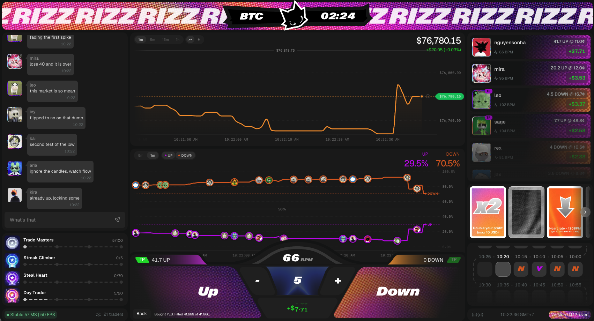
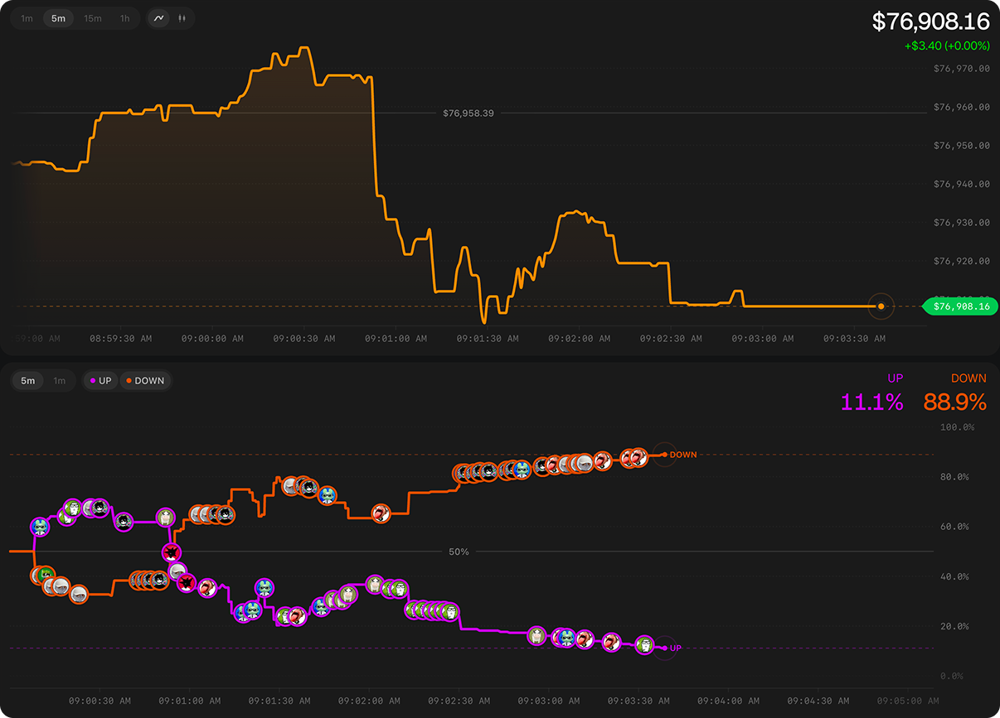
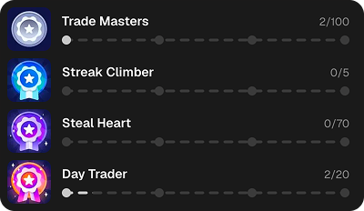
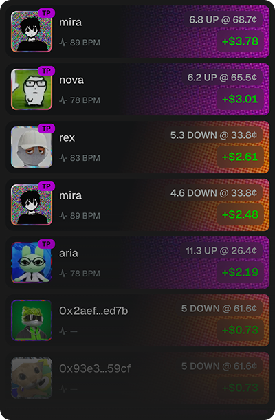
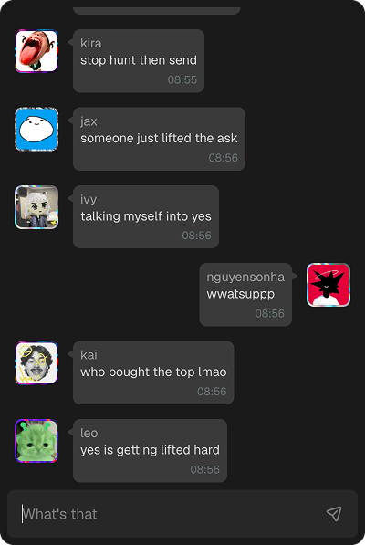
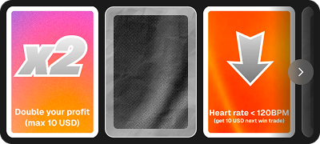
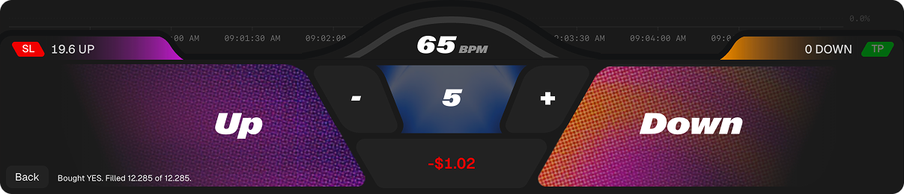

# Rizz Club - Social Trading Platform

Welcome to Rizz Club, where traders enter the trading zone to trade, compete, and hype each other up with the community.

Rizz Club lets traders build their progression, use special abilities to double their profits, protect their funds, and share the excitement with the community.

Rizz runs on dreamDEX EC, focused on the BTC 5m market, and is currently live on the Somnia testnet — so users can faucet STT and tUSDC to try it out risk-free.

### Every Round, Traders Will:

- Enter the trading zone
- Choose their side
- Use an ability card: `Double Profit`, `Protect Fund`, `Steal Heart`, or `Cheers` to fellow traders
- Connect a wearable device to track their heart rate and share the thrill with the community
- Track their progress and unlock badges through the built-in progression system

## Systems

### Charts

Built-in market charts show every trade happening live, along with real-time BTC price action.

### Progression

Track your progress and unlock badges and rewards as you trade:

- Trade Master — Complete 10 trades
- Streak Climber — Win 10 trades in a row
- Poker Face — Trade 10 times in a row on the same side
- Day Trader — Complete 10 trades in a single day

### Leaderboard

- Ranked by total profits
- Resets every round

### Chat

Hang out and connect with the community

### Ability Cards

- Double Profit — Doubles the profit on a winning trade (max $10)
- Protect Fund — Shields your fund from a loss (max $10)
- Steal Heart — If your heart rate is below 120, win $10 on your next winning trade
- Cheers — Share $10 with 10 random traders

### Heart Rate

Connect a wearable device to showcase your trading mental game

### Trading Zone

- Gasless trading
- One-tap trading

## Ecosystem Impact

- Gamified trading (badges, streaks, leaderboard) draws in gaming and social crowds, not just traditional traders
- Wearable integration and social features (Cheers, Steal Heart) create shareable, viral moments
- Leaderboard resets every round, driving continuous engagement instead of one-time wins
- Could attract partnerships with wearable tech, gaming, or social platforms
- Social mechanics (chat, chat, Cheers) build community stickiness beyond pure trading incentives
